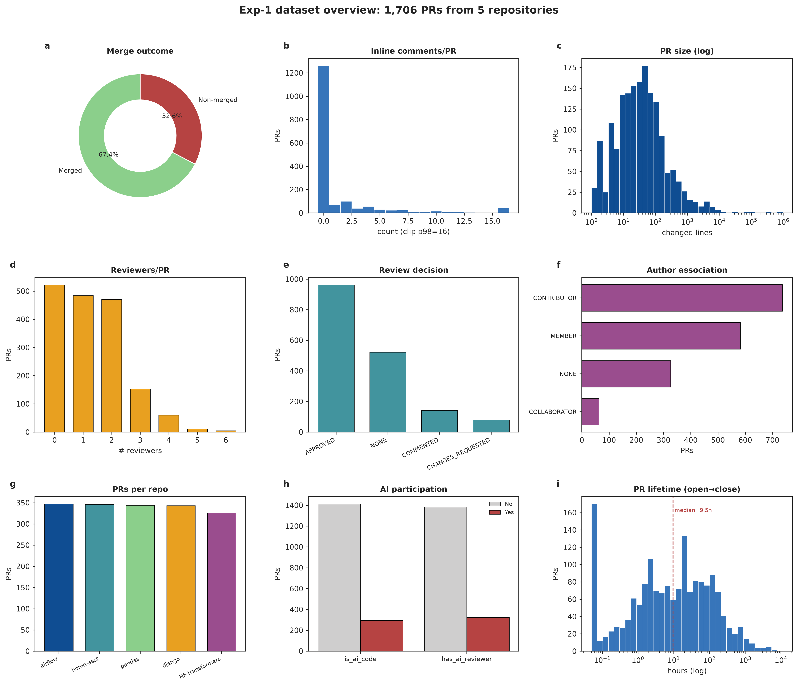

# AI4SA-Exp1

[English](README.md) | 简体中文

## Overview

实验一围绕 GitHub 代码审查数据构建后续智能软件工程实验所需的数据基础。该实验从 5 个活跃的、以 Python 为主的开源仓库中采集已关闭 Pull Request，抽取 PR 元数据、改动文件、提交记录、正式 Review、行内审查评论和讨论区评论，并将这些原始数据规范化为可供后续建模使用的关系型数据表。

实验一还完成了探索性数据分析，覆盖合并结果、行内评论密度、PR 规模、审查者数量、作者身份、AI 参与情况、跨仓库差异和 PR 生命周期等维度。下面的概要图展示了最终数据集的整体分布。



## Table of Contents

- [Key Feature](#key-feature)
- [Installation](#installation)
- [Requirements](#requirements)
- [Usage](#usage)
  - [1. 测试 GitHub 访问](#1-测试-github-访问)
  - [2. 抓取小样本](#2-抓取小样本)
  - [3. 抓取完整数据集](#3-抓取完整数据集)
  - [4. 构建规范化数据表](#4-构建规范化数据表)
  - [5. 运行探索性数据分析](#5-运行探索性数据分析)
- [Limitations](#limitations)

## Key Feature

- 提供后续实验复用的代码审查数据基础，尤其服务于合并预测和审查意见生成两个任务。
- 生成规范化数据表
- 在 `files.patch` 中保留原始 diff，可用于 AST/CFG 特征抽取、CodeBERT 输入构造和 LLM 上下文组织。
- 从行内审查评论中抽取 `(diff_hunk -> review comment)` 配对，为审查意见生成任务提供训练数据。
- 通过 `prs.is_merged` 保存合并预测标签，并且只采集已关闭 PR，保证目标标签已知。
- 添加启发式 AI 标签，包括 `is_ai_code`、`has_ai_reviewer` 以及对应的信号列，便于审计和筛选高置信样本。
- 在 `results/figures/` 下生成可复用的统计图和数据概要。

## Installation

建议使用 `uv` 复现实验环境，或参考 `pyproject.toml` 配置等价的 Python 环境。

在仓库根目录运行：

```bash
uv sync
```

采集 GitHub API 数据需要 token。请在仓库根目录创建或更新 `.env` 文件：

```bash
GITHUB_TOKEN=<your_github_token>
```

下面所有命令都建议从仓库根目录执行：

```bash
cd /home/wzsyh/ai-software-engineer/Experiment1
```

## Requirements

- Python >= 3.12（已在 v3.12.3 测试）
- pandas >= 3.0.3 用于表格数据处理
- pyarrow >= 24.0.0 用于 Parquet 数据集存储
- PyGithub >= 2.9.1 和 requests >= 2.34.2 用于访问 GitHub API
- python-dotenv >= 1.2.2 用于从 `.env` 加载环境变量
- tqdm >= 4.68.3 用于显示进度条
- matplotlib >= 3.11.0 和 seaborn >= 0.13.2 用于探索性数据分析和图表生成

系统路径中必须可用以下工具或配置：

- `uv` 用于复现实验环境
- `GITHUB_TOKEN` 需要配置在仓库根目录 `.env` 文件中，用于访问 GitHub API

## Usage

### 1. 测试 GitHub 访问

检查 token 是否能被正确读取，以及 GitHub API 限额是否可访问：

```bash
uv run python -m src.github_client
```

### 2. 抓取小样本

正式运行完整采集前，可以先用小样本验证流程：

```bash
uv run python -m src.fetch --repo django/django --limit 20 --no-ai
```

原始 PR 缓存会写入：

```text
Experiment1/results/raw/
```

### 3. 抓取完整数据集

采集配置中的 5 个仓库，并启用 AI 信号定向补采：

```bash
uv run python -m src.fetch
```

该步骤支持断点续传。如果某个 PR 的 JSON 文件已经存在，下次运行时会自动跳过。

### 4. 构建规范化数据表

将原始 JSON 数据转换为 Parquet 和 CSV 格式的规范化关系表：

```bash
uv run python -m src.build_dataset
```

输出目录为：

```text
Experiment1/results/processed/
```

### 5. 运行探索性数据分析

生成统计摘要和可视化图表：

```bash
uv run python -m src.analyze
```

图表输出目录为：

```text
Experiment1/results/figures/
```

## Limitations

- AI 代码和 AI 审查者标签是启发式标签，依赖 bot 账号、co-author 标记和文本提示等可见信号，因此可能存在漏判和弱信号误判。
- 行内审查评论较稀疏，很多 PR 没有 `review_comments`，这会限制后续审查意见生成任务的直接训练样本量。
- 不同仓库的行为差异明显，合并率、审查密度和 PR 规模都存在社区差异，后续模型应使用按仓库分层的划分方式，或报告分仓库指标。
- 大 PR 和缺失 patch 可能影响后续解析。GitHub 对过大的 diff 可能不返回 `patch` 字段。
- 数据主要来自以 Python 为中心的 GitHub 开源项目，结论未必能直接推广到私有项目或其他语言生态。
- AI 定向补采提升了实验五所需样本量，但会改变 AI 相关 PR 的自然比例。如果后续分析关注总体 AI 参与率，需要结合 `oversampled` 字段处理该偏差。
