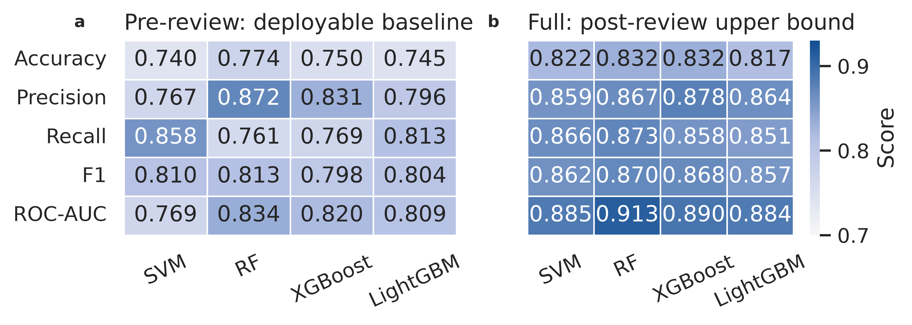

# AI4SA-Exp2

[English](README.md) | 简体中文

## Overview

实验二面向整门课程的 Merge Prediction 任务构建传统机器学习基线。该实验复用实验一生成的 GitHub 代码审查规范化数据表，筛选人类编写代码对应的 Python Pull Request，从已保存的 diff 和 PR 元数据中提取 AST、CFG、代码改动统计和文本特征，并训练 SVM、Random Forest、XGBoost 与 LightGBM 分类器。

实验二刻意区分两套特征设置。`pre` 设置只使用 PR 创建时即可获得的信息，因此代表可部署的审查前预测基线；`full` 设置额外加入 review 数量、reviewer 数量、评论密度等审查过程特征，因此只作为 post-review 上界，而不能解释为真实部署性能。下面的概要图汇总了两种设置下各模型的主要性能。



## Table of Contents

- [Key Feature](#key-feature)
- [Installation](#installation)
- [Requirements](#requirements)
- [Usage](#usage)
  - [1. 提取特征](#1-提取特征)
  - [2. 训练可部署的 Pre-review 模型](#2-训练可部署的-pre-review-模型)
  - [3. 训练 Full 上界模型](#3-训练-full-上界模型)
  - [4. 评估模型](#4-评估模型)
  - [5. 运行标签泄漏消融](#5-运行标签泄漏消融)
- [Limitations](#limitations)

## Key Feature

- 为后续 CodeBERT、大语言模型和 VSCode 插件实验提供低成本、可解释的传统 ML Merge Prediction 基线。
- 复用 `Experiment1/results/processed/` 下的实验一规范化数据表，使数据采集后的实验流程保持自包含。
- 筛选含 Python patch 的人类代码 PR，构建 PR 级特征矩阵用于监督分类。
- 从 diff patch 和 PR 元数据中提取 98 维特征，包括 AST、CFG、改动统计、审查过程、文本和 TF-IDF 特征。
- 使用 tree-sitter 对 diff 重建后的代码片段进行容错解析，避免重新拉取仓库，并将更丰富的 repository 级上下文保留给实验六。
- 使用网格搜索、5 折交叉验证和类别不平衡处理训练 SVM、Random Forest、XGBoost 与 LightGBM。
- 区分 `pre` 与 `full` 两套特征集，用于分离可部署预测和 post-review 上界分析，并量化时间泄漏影响。
- 在 `results/` 下生成可复用的指标、模型、标准化器、训练/验证/测试划分和图表。

## Installation

建议使用 `uv` 复现实验环境，或参考 `pyproject.toml` 配置等价的 Python 环境。

在仓库根目录运行：

```bash
uv sync
```

实验二依赖实验一生成的 processed 数据表。如果这些文件尚不存在，请先运行实验一的数据集构建流程：

```bash
cd /home/wzsyh/ai-software-engineer/Experiment1
uv run python -m src.build_dataset
```

下面所有命令都建议从实验二目录执行：

```bash
cd /home/wzsyh/ai-software-engineer/Experiment2
```

## Requirements

- Python >= 3.12
- pandas 和 pyarrow 用于读取、写入特征表
- scikit-learn 用于预处理、SVM、Random Forest、指标计算和网格搜索
- tree-sitter 和 tree-sitter-python 用于解析 diff 重建后的 Python 代码片段
- xgboost 和 lightgbm 用于梯度提升树基线
- matplotlib 和 seaborn 用于生成评估图表
- tqdm 用于显示进度条

系统路径中必须可用以下工具或输入：

- `uv` 用于复现实验环境
- `Experiment1/results/processed/` 下的实验一 processed 数据表

## Usage

### 1. 提取特征

从实验一 processed 数据表构建 PR 级特征矩阵：

```bash
uv run python -m src.feature_extraction
```

如需快速测试流程，可只提取小样本：

```bash
uv run python -m src.feature_extraction --limit 50
```

特征输出目录为：

```text
Experiment2/results/features/
```

### 2. 训练可部署的 Pre-review 模型

在 `pre` 特征集上训练四个模型，排除审查过程特征带来的时间泄漏：

```bash
uv run python -m src.train --model all --feature-set pre
```

若只训练单个模型，可将 `all` 替换为 `svm`、`rf`、`xgboost` 或 `lightgbm`：

```bash
uv run python -m src.train --model rf --feature-set pre
```

### 3. 训练 Full 上界模型

在 `full` 特征集上训练四个模型，加入审查过程特征用于上界分析：

```bash
uv run python -m src.train --model all --feature-set full
```

模型、标准化器和数据划分文件会写入：

```text
Experiment2/results/models/
```

### 4. 评估模型

分别评估两套特征集下的模型，并生成指标和图表：

```bash
uv run python -m src.evaluate --feature-set pre
uv run python -m src.evaluate --feature-set full
```

评估输出目录为：

```text
Experiment2/results/metrics/
Experiment2/results/figures/
```

### 5. 运行标签泄漏消融

在 `pre` 和 `full` 两组模型均完成评估后，运行两者对比：

```bash
uv run python -m src.evaluate --ablation
```

该步骤会生成标签泄漏消融图和总体性能矩阵：

```text
Experiment2/results/figures/label_leakage_ablation.png
Experiment2/results/figures/model_performance_matrix.png
```

## Limitations

- AST 和 CFG 特征来自 diff patch，而不是完整仓库文件。该方案可复现，适合聚合结构特征，但不能捕获完整程序语义。
- CFG 特征是基于控制流语法的轻量近似，并非完整语义控制流图。
- `full` 特征集包含 `num_reviews`、`num_reviewers` 和评论数量等审查过程特征。这些特征适合上界分析，但包含时间泄漏，不能作为可部署 pre-review 特征使用。
- 数据集筛选为含 Python patch 的人类代码 PR，因此该基线不直接覆盖 AI 生成代码或非 Python 改动。
- 不同仓库的合并率和审查文化差异明显，整体指标需要结合分仓库性能一起解释。
- 传统机器学习模型依赖固定的人工特征。它们具备可解释性和低训练成本，但可能遗漏后续 CodeBERT 或 LLM 方法能够捕获的更丰富代码语义。
