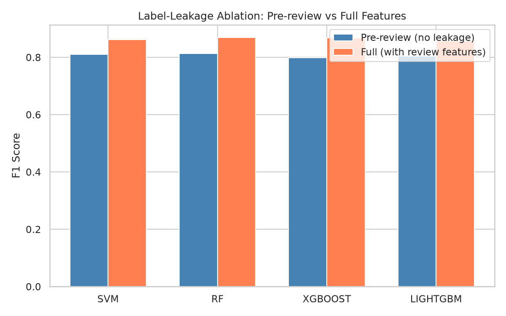

# AI4SA-Exp2

## Overview

Experiment 2 builds the traditional machine-learning baseline for Merge Prediction. It consumes the normalized GitHub code-review dataset produced by Experiment 1, filters to human-authored Python pull requests, extracts hand-crafted AST, CFG, statistical, and text features from the stored diffs and metadata, then trains SVM, Random Forest, XGBoost, and LightGBM classifiers.

The experiment reports two feature settings: a deployable pre-review setting that only uses information available when a pull request is opened, and a full setting that also includes review-process features as an upper bound. The comparison quantifies label leakage from review activity while preserving a fair baseline for later deep-learning and LLM experiments.



## Table of Contents

- [Key Feature](#key-feature)
- [Installation](#installation)
- [Requirements](#requirements)
- [Usage](#usage)
  - [1. Extract Features](#1-extract-features)
  - [2. Train Models](#2-train-models)
  - [3. Evaluate Models](#3-evaluate-models)
  - [4. Run Label-Leakage Ablation](#4-run-label-leakage-ablation)
- [Limitations](#limitations)

## Key Feature

- Provides a traditional ML baseline for the course-wide Merge Prediction task.
- Reuses Experiment 1 normalized tables under `Experiment1/results/processed/`, keeping the experiment pipeline self-contained after data collection.
- Extracts 98-dimensional PR-level features from diff patches and PR metadata, including AST, CFG, statistical, text, and TF-IDF features.
- Uses diff-only code analysis with tree-sitter error-tolerant parsing, avoiding repository re-fetching and preserving the Experiment 6 boundary for richer repository context.
- Trains SVM, Random Forest, XGBoost, and LightGBM models with grid search and 5-fold cross-validation.
- Separates `pre` and `full` feature sets to distinguish deployable pre-review prediction from post-review upper-bound analysis.
- Generates reusable metrics and figures under `results/metrics/` and `results/figures/`.

## Installation

It is recommended to reproduce the experiment environment with `uv`, or configure an equivalent Python environment based on `pyproject.toml`.

From the repository root:

```bash
uv sync
```

Experiment 2 depends on the processed tables generated by Experiment 1. If they do not exist yet, run the Experiment 1 dataset builder first:

```bash
cd /home/wzsyh/ai-software-engineer/Experiment1
uv run python -m src.build_dataset
```

All commands below should be run from the repository root:

```bash
cd /home/wzsyh/ai-software-engineer/Experiment2
```

## Requirements

- Python >= 3.12 (tested on v3.12.3)
- pandas >= 3.0.3 and pyarrow >= 24.0.0 for reading and writing feature tables
- scikit-learn >= 1.9.0 for preprocessing, SVM, Random Forest, metrics, and grid search
- tree-sitter >= 0.26.0 and tree-sitter-python >= 0.25.0 for AST parsing from diff-reconstructed Python code
- xgboost >= 3.3.0 and lightgbm >= 4.6.0 for boosted-tree baselines
- matplotlib >= 3.11.0 and seaborn >= 0.13.2 for evaluation figures
- tqdm >= 4.68.3 for progress bars

The following inputs and tools must be available:

- `uv` for reproducing the experiment environment
- Experiment 1 processed tables in `Experiment1/results/processed/`

## Usage

### 1. Extract Features

Build the PR-level feature matrix from Experiment 1 processed tables:

```bash
uv run python -m src.feature_extraction
```

For a quick smoke test, extract features from a smaller sample:

```bash
uv run python -m src.feature_extraction --limit 50
```

Feature outputs are written to:

```text
Experiment2/results/features/
```

### 2. Train Models

Train all four models on the full feature set, including review-process features:

```bash
uv run python -m src.train --model all --feature-set full
```

Train all four models on the pre-review feature set, excluding review-process leakage:

```bash
uv run python -m src.train --model all --feature-set pre
```

To train a single model, replace `all` with `svm`, `rf`, `xgboost`, or `lightgbm`:

```bash
uv run python -m src.train --model rf --feature-set pre
```

Model, scaler, and split artifacts are written to:

```text
Experiment2/results/models/
```

### 3. Evaluate Models

Evaluate trained models and generate metrics and figures for each feature set:

```bash
uv run python -m src.evaluate --feature-set full
uv run python -m src.evaluate --feature-set pre
```

Evaluation outputs are written to:

```text
Experiment2/results/metrics/
Experiment2/results/figures/
```

### 4. Run Label-Leakage Ablation

After both `full` and `pre` models have been evaluated, compare the two settings:

```bash
uv run python -m src.evaluate --ablation
```

This step generates the label-leakage comparison figure:

```text
Experiment2/results/figures/label_leakage_ablation.png
```

## Limitations

- AST and CFG features are extracted from diff patches rather than complete repository files. This is reproducible and sufficient for aggregate structural features, but it cannot capture full-program semantics.
- CFG features are lightweight approximations based on control-flow syntax, not full semantic control-flow graphs.
- The `full` feature set includes review-process features such as `num_reviews`, `num_reviewers`, and comment counts. These features are useful for upper-bound analysis but contain temporal leakage and should not be used as deployable pre-review performance.
- The dataset is filtered to human-authored PRs with Python patches, so the baseline does not directly cover AI-generated code or non-Python changes.
- Repository behavior differs strongly. Merge rates and review culture vary across projects, so aggregate performance should be interpreted together with per-repository metrics.
- Traditional ML models require fixed hand-crafted features. They provide interpretability and low training cost, but may miss richer code semantics that later CodeBERT or LLM experiments are expected to explore.
