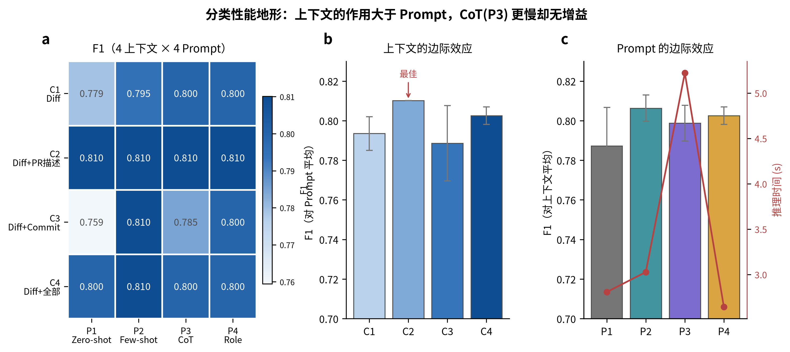

# AI4SA-Exp4

[English](README.md) | 简体中文

## Overview

实验四面向人类编写代码的 Pull Request，评估基于 Prompt Engineering 的大语言模型（LLM）代码审查方案。实验复用实验一生成的 GitHub 代码审查规范化数据表，以及实验二保存的人类代码 Python Pull Request 划分；不对 LLM 进行微调，而是系统比较输入给模型的信息与指令设计。

实现将四种 PR 上下文——仅 Diff、Diff + PR 描述、Diff + Commit Message、Diff + 全部信息——与 Zero-shot、Few-shot、Chain-of-Thought 和 Role-based 四种 Prompt 组合，并通过 OpenAI 兼容 SDK 调用 DeepSeek，完成 Merge Prediction 和 Review Comment Generation 两个任务。两个任务均使用固定的 50 条测试 PR 样本；下图展示了 16 种上下文—Prompt 组合下的 Merge Prediction 性能概览。



关于完整的设计、评估协议与结果解释，请参阅[实验四设计文档](docs/design-docs/exp4-llm.md)。

## Table of Contents

- [Key Feature](#key-feature)
- [Installation](#installation)
- [Requirements](#requirements)
- [Usage](#usage)
  - [1. 构建可复现样本](#1-构建可复现样本)
  - [2. 冒烟测试 LLM 访问](#2-冒烟测试-llm-访问)
  - [3. 运行一个小规模条件](#3-运行一个小规模条件)
  - [4. 运行完整实验矩阵](#4-运行完整实验矩阵)
  - [5. 评估并生成可视化结果](#5-评估并生成可视化结果)
- [Limitations](#limitations)

## Key Feature

- 使用 LLM 实现贯穿课程的 Merge Prediction 与 Review Comment Generation 任务，衔接传统机器学习和深度学习两阶段的代码审查流程。
- 从 Python diff patch、PR 标题/描述和 Commit Message 构建四种逐渐丰富的 PR 上下文，并对输入长度设置明确预算。
- 在每个任务上完整比较 4 种上下文 × 4 种 Prompt：Zero-shot、Few-shot、Chain-of-Thought 与 Role-based。
- 使用固定、可复现的 50 条测试 PR：分类任务按仓库和合并标签分层抽样；生成任务使用含人类顶层行内审查意见的 PR。
- Few-shot 的分类和生成示例全部仅来自实验二训练集，避免测试集信息泄漏。
- 通过 OpenAI 兼容客户端调用 `deepseek-v4-flash`，结合按任务设置的 temperature、JSON 结构化输出、失败重试、延迟记录和磁盘响应缓存。
- 分类任务评估 Accuracy、Precision、Recall、F1、解析失败率和推理时间；生成任务评估语料级 BLEU-4、ROUGE-1/2/L 和推理时间。
- 在同一批 50 条分类 PR 上重新评估实验二的 SVM、Random Forest、XGBoost 和 LightGBM，获得公平的传统 ML 对照。
- 在 `results/` 下输出可复用的样本、缓存响应、结构化预测、指标，以及出版级 SVG/PNG 图表。

## Installation

建议使用 `uv` 复现项目环境，或参考仓库根目录的 `pyproject.toml` 配置等价 Python 环境。

在仓库根目录运行：

```bash
uv sync
```

实验四依赖实验一的 processed 数据表，以及实验二 `pre` 特征集对应的数据划分、标准化器和已训练模型。若这些产物尚不存在，请先构建：

```bash
cd /home/wzsyh/ai-software-engineer/Experiment1
uv run python -m src.build_dataset

cd /home/wzsyh/ai-software-engineer/Experiment2
uv run python -m src.feature_extraction
uv run python -m src.train --model all --feature-set pre
```

LLM 推理需要 DeepSeek API key。请将其加入仓库根目录、且已被 Git 忽略的 `.env` 文件：

```bash
DEEPSEEK_API_KEY=<your_deepseek_api_key>
```

下面所有实验四命令均建议在以下目录执行：

```bash
cd /home/wzsyh/ai-software-engineer/Experiment4
```

## Requirements

- Python >= 3.12
- `openai` 与 `python-dotenv`：调用兼容 OpenAI 接口的 DeepSeek 服务并加载 `.env`
- pandas 与 pyarrow：读取前序实验数据表并写入 Parquet 预测结果
- scikit-learn：计算分类指标，并重评实验二的同样本传统 ML 基线
- sacrebleu 与 rouge-score：评估审查意见生成结果
- matplotlib、seaborn 与 tqdm：生成图表和显示进度

系统中还必须具备以下工具或输入：

- `uv`，用于复现项目环境
- 可访问的 DeepSeek API，以及仓库根目录 `.env` 中的 `DEEPSEEK_API_KEY`
- `Experiment1/results/processed/` 下的实验一 processed 数据表
- `Experiment2/results/features/` 和 `Experiment2/results/models/` 下实验二的 `pre` 产物

默认的 API 调用流程不需要本地 GPU。

## Usage

### 1. 构建可复现样本

生成固定的测试样本与 Few-shot 示例。分类任务的 50 条 PR 按仓库和合并标签分层抽样；生成任务的 50 条 PR 均含人类行内审查意见。Few-shot 示例只从训练集选择。

```bash
uv run python -m src.sampling
```

样本定义会写入：

```text
Experiment4/results/samples/
```

### 2. 冒烟测试 LLM 访问

检查能否读取 DeepSeek key 并成功完成一次 API 请求。测试结束后会删除本次冒烟产生的缓存条目。

```bash
uv run python -m src.llm_client
```

### 3. 运行一个小规模条件

在付费运行完整矩阵前，先在一个上下文—Prompt 条件下运行 3 条分类 PR：

```bash
uv run python -m src.run_experiments --task classify --only C1 P1 --limit 3
```

其中 `C1` 为仅 Diff 上下文，`P1` 为 Zero-shot Prompt。该命令会写入或合并到：

```text
Experiment4/results/predictions/classify_predictions.parquet
```

### 4. 运行完整实验矩阵

对两个任务运行完整的 4 种上下文 × 4 种 Prompt × 50 条 PR 矩阵：

```bash
uv run python -m src.run_experiments --task all
```

在没有缓存命中的情况下，每个任务需要 800 次调用，共 1,600 次。响应会缓存在 `results/cache/` 下，因此中断后可继续运行，不会重复调用已完成的语义请求。若只运行一个任务，可将 `all` 替换为 `classify` 或 `generate`。

结构化预测结果写入：

```text
Experiment4/results/predictions/classify_predictions.parquet
Experiment4/results/predictions/generate_predictions.parquet
```

### 5. 评估并生成可视化结果

计算两个任务的指标，在同一分类样本上重评实验二的传统 ML 模型，并生成 4 张结果图：

```bash
uv run python -m src.evaluate
```

指标与图表分别写入：

```text
Experiment4/results/metrics/
Experiment4/results/figures/
```

如只需计算指标而不重新生成图表，可加入 `--no-figures`。若已有预测与指标、只需重新出图，可运行：

```bash
uv run python -m src.visualization
```

## Limitations

- 默认流程依赖在线第三方 LLM 服务；服务可用性、延迟、价格与模型行为可能变化。缓存可保存已完成响应，但无法消除这项外部依赖。
- 两个任务的主评估均使用固定 50 条 PR 样本。这样可以控制成本并保证可复现性，但不能替代完整测试集或跨项目评估。
- 上下文仅由已保存的 Python diff patch、PR 元数据和 Commit Message 组成。超长输入会按固定预算截断；仓库级、跨文件和历史上下文刻意留给后续实验。
- Merge Prediction 的标签是事后结果，还可能受到项目政策、reviewer 可用性等输入上下文无法完整观测的因素影响。
- Review Comment Generation 每个 PR 只以最早的一条人类顶层行内意见为参照。合理意见可以关注不同问题或使用不同表述，因此 BLEU 和 ROUGE 更适合作为条件间的比较信号，而不是审查价值的完整度量。
- 当前实现只覆盖带可用 Python patch 的人类代码 PR 和四种预定义 Prompt 策略，不能直接证明其对 AI 生成代码、其他语言或其他 LLM 的性能。
