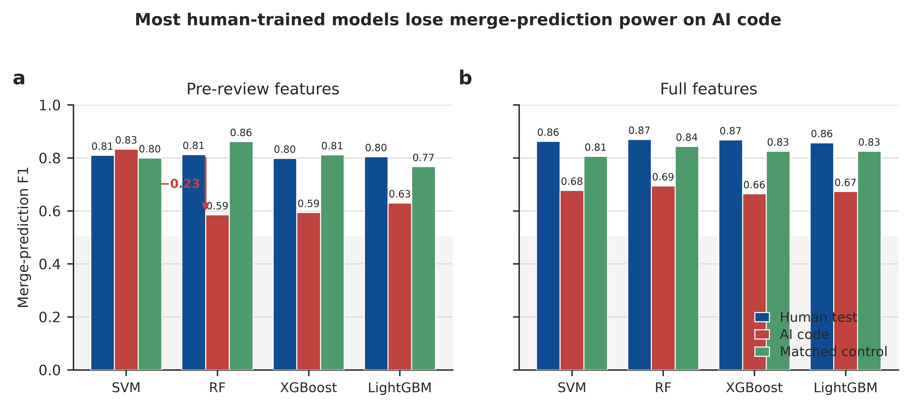

# AI4SE-Exp5

[English](README.md) | 简体中文

## 概述

实验五检验已有代码审查模型能否从人类编写代码泛化到 AI 生成代码。它是实验一、二、四的下游消费者：不重新训练模型，也不设计新的 Prompt 或上下文策略，而是将既有的合并预测和审查意见生成流水线应用于 AI 代码 PR，并与按分布匹配的人类对照组比较。

实验覆盖两个任务：使用实验二传统机器学习模型和实验四 LLM 条件进行合并预测，以及使用实验四 LLM 条件进行审查意见生成。最终产出模型指标、AI 与人类的性能对比、上下文敏感度分析、待人工归因的错误案例候选，以及 6 张分析图。



## 目录

- [核心特性](#核心特性)
- [安装](#安装)
- [环境要求](#环境要求)
- [使用方法](#使用方法)
  - [1. 查看配置](#1-查看配置)
  - [2. 构造可复现样本](#2-构造可复现样本)
  - [3. 提取 ML 特征](#3-提取-ml-特征)
  - [4. 运行 ML 合并预测](#4-运行-ml-合并预测)
  - [5. LLM 流水线冒烟](#5-llm-流水线冒烟)
  - [6. 运行完整 LLM 矩阵](#6-运行完整-llm-矩阵)
  - [7. 评估与可视化](#7-评估与可视化)
  - [8. 分析性能差距与错误案例](#8-分析性能差距与错误案例)
- [产物](#产物)
- [局限性](#局限性)

## 核心特性

- 零重训复用实验二保存的 SVM、随机森林、XGBoost 和 LightGBM 合并预测模型。
- 零改动复用实验四的 16 个 LLM 条件：4 个上下文级别（`C1`-`C4`）与 4 个 Prompt（`P1`-`P4`）的组合。
- 将 AI 生成代码结果与人类锚点、按仓库和合并结果分布匹配的人类对照组进行比较。
- 严格保持 ML 推理边界：固定 TF-IDF 词表和 IDF、scaler、模型均只在上游人类数据上拟合；AI 和对照数据只做 transform。
- 复用实验四的 LLM 缓存，支持幂等重跑，并让兼容的人类生成对照直接命中已有缓存。
- 使用固定随机种子 `42`，将样本键落盘以保证 LLM 抽样可复现。
- 输出指标 JSON、结构化预测、错误案例候选和 6 张分析图。

## 安装

建议使用 `uv` 复现实验环境，或依据仓库根目录的 `pyproject.toml` 配置等价 Python 环境。

在仓库根目录运行：

```bash
uv sync
```

LLM 执行需要在仓库根目录 `.env` 中配置 DeepSeek API Key：

```bash
DEEPSEEK_API_KEY=<your_deepseek_api_key>
```

实验五消费实验一、二、四的既有产物。若从干净环境复现，请先确保以下输入存在：

- `Experiment1/results/processed/`：PR、文件、提交、Review 和行内评论数据。
- `Experiment2/results/features/`、`Experiment2/results/models/`、`Experiment2/results/metrics/`：保存的 ML 工件与人类测试集指标。
- `Experiment4/results/samples/`、`Experiment4/results/metrics/`：人类 LLM 基线；LLM 响应自动复用 `Experiment4/results/cache/`。

下列所有命令均在实验五目录执行：

```bash
cd /home/wzsyh/ai-software-engineer/Experiment5
```

## 环境要求

- Python >= 3.12
- 系统路径中可用 `uv`
- 已安装仓库根目录 `pyproject.toml` 声明的依赖，包括 pandas、pyarrow、scikit-learn、tree-sitter、xgboost、lightgbm、OpenAI 兼容客户端、sacrebleu、rouge-score、matplotlib 和 seaborn
- 已完成或已恢复[安装](#安装)中列出的实验一、二、四产物
- 运行 `src.run_llm` 时，根目录 `.env` 需要 `DEEPSEEK_API_KEY`；ML 抽样、特征提取、预测和本地评估不需要 API

## 使用方法

### 1. 查看配置

打印 AI 代码筛选配置、模型矩阵、样本量和共享 LLM 缓存位置：

```bash
uv run python -m src.config
```

### 2. 构造可复现样本

使用固定随机种子创建并落盘 4 组样本：

- AI 分类样本：按仓库和合并结果分层抽取 50 条 PR。
- 匹配人类分类对照：从实验二 held-out test 池中按相同分层分布抽取。
- AI 生成样本：使用所有拥有顶层行内审查评论真值的合格 PR。
- 人类生成对照：复用实验四的人类生成样本。

```bash
uv run python -m src.sampling
```

样本清单写入：

```text
Experiment5/results/samples/
```

### 3. 提取 ML 特征

为 AI 与匹配对照分类池构建与实验二兼容的特征矩阵。该步骤恢复上游固定 TF-IDF 词表，并自检重建后的人类 TF-IDF 值与实验二特征表一致。

```bash
uv run python -m src.ml_features
```

小规模本地冒烟：

```bash
uv run python -m src.ml_features --limit 5
```

特征矩阵写入：

```text
Experiment5/results/features/
```

### 4. 运行 ML 合并预测

将实验二保存的 4 个模型应用到 `pre` 和 `full` 两套特征上。已拟合的 scaler 和模型仅用于推理。

```bash
uv run python -m src.ml_predict
```

小规模本地冒烟：

```bash
uv run python -m src.ml_predict --limit 5
```

预测和指标写入：

```text
Experiment5/results/predictions/ml_{ai,control}_{pre,full}.parquet
Experiment5/results/metrics/ml_metrics.json
```

### 5. LLM 流水线冒烟

在产生完整调用费用前，先使用一个上下文/Prompt 条件和每组 3 条样本验证流水线。只有实验四中不存在兼容缓存时才会发起 LLM 请求。

```bash
uv run python -m src.run_llm --task all --only C1 P1 --limit 3
```

### 6. 运行完整 LLM 矩阵

对 AI 代码与匹配人类对照运行 16 个条件（`C1`-`C4` x `P1`-`P4`）。分类使用 50 条 AI 样本和 50 条对照样本；生成使用全部合格 AI 样本与实验四人类生成对照样本。

```bash
uv run python -m src.run_llm --task classify --group ai
uv run python -m src.run_llm --task all
```

常用开关：

```bash
uv run python -m src.run_llm --task classify --only C1 P1
uv run python -m src.run_llm --task generate --group control
uv run python -m src.run_llm --task all --limit 3
```

LLM 输出写入：

```text
Experiment5/results/predictions/{classify,generate}_predictions.parquet
```

### 7. 评估与可视化

按组和条件计算指标，将实验二、四的人类锚点与 AI 和匹配对照结果汇总，并生成已具备数据的图表：

```bash
uv run python -m src.evaluate
```

只计算指标、不出图：

```bash
uv run python -m src.evaluate --no-figures
```

单独重新出图：

```bash
uv run python -m src.visualization
```

### 8. 分析性能差距与错误案例

生成实验的三条证据链：性能差值定位、`C1` 到 `C4` 的上下文敏感度，以及需要人工归因的数据驱动错误案例候选。

```bash
uv run python -m src.analysis
```

推荐执行顺序：

```text
sampling -> ml_features -> ml_predict -> run_llm（先冒烟，再全量）-> evaluate -> analysis -> visualization
```

## 产物

```text
Experiment5/results/
├── samples/
│   ├── classify_ai.json
│   ├── classify_control.json
│   ├── generate_ai.json
│   └── generate_control.json
├── features/
│   ├── ai_features.parquet
│   └── control_features.parquet
├── predictions/
│   ├── ml_{ai,control}_{pre,full}.parquet
│   └── {classify,generate}_predictions.parquet
├── metrics/
│   ├── ml_metrics.json
│   ├── llm_{classify,generate}_metrics.json
│   ├── human_vs_ai.json
│   ├── performance_gap_localization.json
│   └── context_sensitivity.json
├── cases/
│   ├── error_cases.json
│   └── error_case_attribution_template.md
└── figures/
    └── fig1_ml_performance.png ... fig6_error_cases.png
```

核心产物为 `metrics/human_vs_ai.json`：其中记录实验二、四的人类锚点、AI 代码结果、匹配人类对照结果，以及 AI 相对人类或匹配对照的指标差值。错误案例归因模板是审查辅助材料，自动生成的描述仅是待验证假设，并非已确认根因。

## 局限性

- AI 代码识别继承实验一的启发式标签。co-author 标记、bot 身份、标签和文本信号可能漏掉 AI 辅助代码，也可能引入弱信号误判。
- 合并标签反映仓库最终结果，而不只反映代码质量。流程策略、维护者可用性和项目优先级均可能导致 PR 未合并。
- AI 与人类池的天然仓库分布和类别分布不同。匹配人类对照能够控制仓库和合并结果构成，但无法消除时间、作者或项目层面的全部混杂因素。
- `full` ML 特征集包含审查过程信息，仅作为泄漏增益消融保留，不代表审查前的真实部署场景；`pre` 是面向可部署性的主结果。
- BLEU 与 ROUGE 只衡量与单条历史行内评论的词面重叠，无法完整评价审查意见的正确性、可操作性、覆盖度或其他同样合理的表达。
- LLM 输出、可用性和延迟依赖外部 API。共享缓存改善了复现性与成本控制，但未命中的重跑仍可能随底层服务变化而不同。