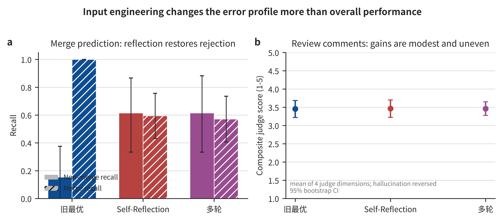

# AI4SA-Exp6

English | [简体中文](README-zh.md)

## Overview

Experiment 6 improves large-language-model code review for AI-generated code without retraining or replacing the model. Building on the AI and matched-human samples from Experiment 5, it studies whether richer software-engineering context and prompt optimization can improve merge prediction and review-comment generation.

The experiment organizes context as a monotonic ladder from L0 to L4: a local diff, pull request and commit metadata, complete pre-change and post-change functions or files, linked issues and historical reviews, and lightweight repository-level lexical retrieval. It also compares the best previous prompt with P5 Self-Reflection and P6 multi-turn interaction. The overview figure below summarizes the main results.



## Table of Contents

- [Key Feature](#key-feature)
- [Installation](#installation)
- [Requirements](#requirements)
- [Usage](#usage)
  - [1. Inspect the Configuration and Experiment Matrix](#1-inspect-the-configuration-and-experiment-matrix)
  - [2. Reproduce the Previous Best Prompt Selection](#2-reproduce-the-previous-best-prompt-selection)
  - [3. Run Offline Tests](#3-run-offline-tests)
  - [4. Run a Small End-to-End Sample](#4-run-a-small-end-to-end-sample)
  - [5. Run the Full Experiment Matrix](#5-run-the-full-experiment-matrix)
  - [6. Evaluate the Predictions](#6-evaluate-the-predictions)
  - [7. Regenerate the Figures](#7-regenerate-the-figures)
- [Limitations](#limitations)

## Key Feature

- Reuses the Experiment 5 AI-generated-code and matched-human samples, keeping Experiment 6 directly comparable with the previous performance-gap analysis.
- Builds a five-level context ladder from L0 local diff context to L4 repository-level context, with explicit character and token budgets at each level.
- Adds P5 Self-Reflection and P6 multi-turn prompts while retaining the empirically selected best prompts from earlier experiments as baselines.
- Uses a focused 10-condition matrix per task rather than a full Cartesian grid, covering context ablation, prompt ablation, attribution, and matched-human controls.
- Evaluates merge prediction with balanced accuracy, per-class precision, recall, and F1, confusion matrices, and non-merge recall instead of relying only on accuracy and merge-class F1.
- Evaluates generated comments with a separate `deepseek-v4-pro` judge for relevance, actionability, correctness, and hallucination, while retaining BLEU and ROUGE for comparison with earlier experiments.
- Separates GitHub fetch caching from the shared Experiment 4 LLM cache and includes the model identity in LLM cache keys to prevent executor and judge responses from colliding.
- Produces prediction tables, machine-readable metrics, Experiment 5 baseline deltas, publication-ready figures, and source CSV files under `results/`.

## Installation

It is recommended to reproduce the experiment environment with `uv`, or configure an equivalent Python environment based on `pyproject.toml`.

From the repository root:

```bash
uv sync
```

Model inference and L2-L4 context construction require API credentials. Create or update the root `.env` file:

```bash
GITHUB_TOKEN=<your_github_token>
DEEPSEEK_API_KEY=<your_deepseek_api_key>
```

All commands below should be run from the Experiment 6 directory:

```bash
cd /home/wzsyh/ai-software-engineer/Experiment6
```

## Requirements

- Python >= 3.12 (tested on v3.12.3)
- pandas >= 3.0.3 and pyarrow >= 24.0.0 for sample and prediction tables
- openai >= 2.44.0 for the DeepSeek OpenAI-compatible API
- PyGithub >= 2.9.1 and requests >= 2.34.2 for GitHub context retrieval
- scikit-learn >= 1.9.0 for classification metrics
- sacrebleu >= 2.6.0 and rouge-score >= 0.1.2 for generation metrics
- matplotlib >= 3.11.0 and seaborn >= 0.13.2 for result visualization

The following inputs and configuration must also be available:

- `uv` in the system path for reproducing the experiment environment
- `Experiment5/results/samples/` and `Experiment5/results/metrics/` from Experiment 5
- `GITHUB_TOKEN` in the repository root `.env` file for L2-L4 GitHub context retrieval
- `DEEPSEEK_API_KEY` in the repository root `.env` file for executor and judge calls

## Usage

### 1. Inspect the Configuration and Experiment Matrix

Print the model configuration, L0-L4 context definitions, prompt selection, and the 10 conditions used by each task:

```bash
uv run python -m src.config
```

### 2. Reproduce the Previous Best Prompt Selection

Select the previous best prompt from Experiment 5 metrics and verify that it agrees with `config.PSTAR`:

```bash
uv run python -m src.select_pstar
```

The selection record is written to:

```text
Experiment6/results/metrics/pstar_selection.json
```

### 3. Run Offline Tests

Validate context construction, prompt behavior, executor-judge cache isolation, output parsing, and evaluation metrics without network or paid API calls:

```bash
uv run python -m src.tests
```

### 4. Run a Small End-to-End Sample

Before the full run, execute one classification condition and one generation condition on a single sample:

```bash
uv run python -m src.run_experiments --task classify --only L0 P1 --limit 1
uv run python -m src.run_experiments --task generate --only L4 P5 --limit 1
```

The L4 generation sample exercises GitHub context retrieval, model inference, and LLM judging. Retrieved context is cached under `results/fetch_cache/`, and predictions are written under `results/predictions/`.

### 5. Run the Full Experiment Matrix

Run either task separately or both tasks in sequence:

```bash
uv run python -m src.run_experiments --task classify
uv run python -m src.run_experiments --task generate
uv run python -m src.run_experiments --task all
```

Use `--only LEVEL PROMPT` to run one condition, `--limit N` to restrict the number of samples per condition, or `--no-judge` to skip generation judging. Each task evaluates 10 conditions: five context-ladder conditions, three L4 prompt conditions, one L0 attribution condition, and two matched-human controls, with duplicate cells counted once.

### 6. Evaluate the Predictions

Compute classification and generation metrics, compare compatible cells with Experiment 5 baselines, and generate the final figures:

```bash
uv run python -m src.evaluate
```

Use `--task classify` or `--task generate` to evaluate one task, and use `--no-figures` to calculate metrics only. Outputs are written to:

```text
Experiment6/results/metrics/
Experiment6/results/figures/
```

### 7. Regenerate the Figures

Regenerate the six publication-ready figures and their source CSV files from existing metrics and predictions:

```bash
uv run python -m src.nature_viz
```

The full interpretation of the results is available in [实验六结果分析.md](实验六结果分析.md).

## Limitations

- AI-generated-code labels and matched-human controls are inherited from Experiment 5. Heuristic label noise or imperfect matching therefore propagates into this experiment.
- Merge status is a workflow outcome rather than a pure code-quality label. Some non-merged pull requests are closed for procedural reasons, so non-merge errors require case-level interpretation.
- L4 uses lightweight lexical repository retrieval rather than semantic retrieval, a repository clone, or a full dependency graph. It may miss behaviorally related code with different names.
- GitHub may omit oversized patches, referenced issues may be unavailable, and API failures can leave some samples with incomplete higher-level context. Disk caching improves reproducibility but cannot restore unavailable data.
- The generation judge uses a stronger model from the same provider as the executor. This reduces direct self-evaluation but does not eliminate provider-specific judging bias.
- P6 requires additional model turns, and generation judging adds another paid call. Quality improvements should therefore be considered together with latency and API cost.
- The experiment uses a focused matrix and a limited AI-code sample. Bootstrap confidence intervals expose uncertainty, but small differences should not be treated as broadly generalizable.
