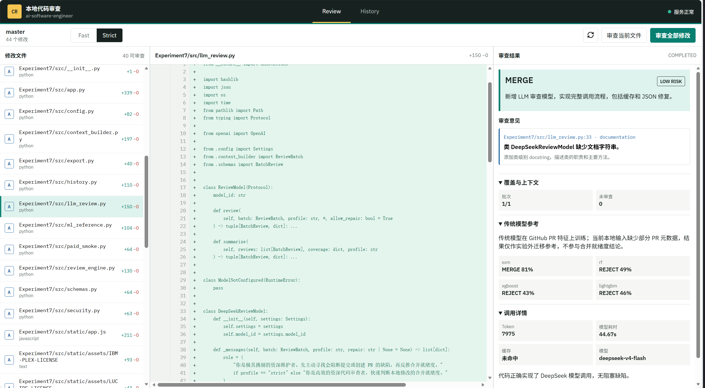

# AI4SE-Exp7

English | [简体中文](README-zh.md)

## Overview

Experiment 7 turns the course code-review pipeline into a local Web workbench. It locks a readable Git worktree, constructs a normalized `HEAD -> worktree` snapshot from staged, unstaged, deleted, renamed, and untracked files, and exposes that snapshot through a browser interface and a versioned FastAPI service. DeepSeek provides the primary review and merge-readiness assessment, while the four Experiment 2 pre-review classifiers provide explicitly labelled reference signals.

The central output is **local merge readiness**: whether the current changes are sufficiently reviewed to enter a commit or pull request. It is not a prediction of the final GitHub merge decision because local changes do not contain PR discussions, reviewer decisions, or maintainer outcomes. The screenshot below shows the delivered workbench.



## Table of Contents

- [Key Feature](#key-feature)
- [Installation](#installation)
- [Requirements](#requirements)
- [Usage](#usage)
  - [1. Prepare the Environment](#1-prepare-the-environment)
  - [2. Start the Workbench](#2-start-the-workbench)
  - [3. Run a Review](#3-run-a-review)
  - [4. Run Offline Tests](#4-run-offline-tests)
  - [5. Run the Explicit Paid Smoke Test](#5-run-the-explicit-paid-smoke-test)
- [API](#api)
- [Troubleshooting](#troubleshooting)
- [Limitations](#limitations)

## Key Feature

- Provides a local, browser-based review workflow with a desktop three-column layout and mobile Files, Diff, and Result tabs.
- Normalizes staged and unstaged Git state into one deterministic snapshot, including added, modified, deleted, renamed, and untracked files.
- Applies path traversal, symlink, binary, sensitive-path, credential-pattern, and file-size checks before outbound review.
- Uses snapshot hashes, visible preflight, HTTP 409 optimistic concurrency, and dynamic stale detection to keep results tied to the reviewed code state.
- Supports DeepSeek `strict` Self-Reflection and `fast` profiles with structured JSON, retries, one format-repair attempt, usage reporting, and content caching.
- Limits each review to at most four code-review batches plus one structured summary; partial failures or uncovered changes force `INCOMPLETE`.
- Integrates Experiment 2 SVM, Random Forest, XGBoost, and LightGBM `pre-review` models with the scaler's 93-column feature order.
- Stores atomic UTF-8 JSONL history with a 200-record cap, filtering, pagination, deletion, clearing, and JSON/Markdown export.

## Installation

From the repository root, synchronize the Python 3.12 environment and install the browser required by the UI tests:

```bash
uv sync
uv run playwright install chromium
```

To enable primary DeepSeek reviews, configure the key in the shell environment:

```bash
export DEEPSEEK_API_KEY=<your_key>
```

The service also starts without the key in degraded mode. Workspace, diff, history, and model-asset status remain available, while paid review requests are disabled.

## Requirements

- Python >= 3.12
- `uv` for environment and dependency reproduction
- FastAPI, Uvicorn, Pydantic, and HTTPX for the local service and API tests
- OpenAI-compatible client support for DeepSeek requests
- scikit-learn, XGBoost, and LightGBM for the Experiment 2 reference models
- pytest and Playwright for offline API and browser tests
- A readable Git worktree with at least one valid commit at `HEAD`
- Experiment 2 `pre-review` model assets and scaler for ML references; missing assets do not block LLM review

No Node.js build, frontend package manager, CDN, or remote browser service is required.

## Usage

All commands below should be run from the Experiment 7 directory:

```bash
cd /home/wzsyh/ai-software-engineer/Experiment7
```

### 1. Prepare the Environment

Install the project environment and browser once:

```bash
uv sync
uv run playwright install chromium
```

### 2. Start the Workbench

Start the service against the root of the Git worktree to review:

```bash
uv run python -m src.app serve --repo /absolute/path/to/git-worktree
```

Open <http://127.0.0.1:8765>. The `--port` option changes the port; `--host` can change the bind address, but non-loopback binding is warned because the service can read repository source code.

### 3. Run a Review

1. Select a changed file and inspect its read-only diff.
2. Choose `Strict` or `Fast`, then review the current file or all changes.
3. Inspect preflight scope, exclusions, character count, context sources, and batch plan before the request is sent.
4. Inspect merge readiness, risk, findings, coverage gaps, four-model references, token usage, latency, and cache status.
5. Select a finding to locate and highlight the changed line; use History to filter, reopen, delete, or export a review.

Diffs are not stored by default. If `include_diff_in_history=true` is requested, only security-approved diff text within the configured character budget is retained.

### 4. Run Offline Tests

The default suite makes no paid API requests:

```bash
uv run pytest tests -q
```

The tests use temporary real Git repositories, FastAPI `TestClient`, deterministic LLM stubs, and Python Playwright. They cover Git state normalization, security blocking, snapshot conflicts, stale results, the four-plus-one request cap, model transforms, history and exports, desktop/mobile layouts, and finding navigation.

### 5. Run the Explicit Paid Smoke Test

The following command calls DeepSeek only when an API key and explicit confirmation are both present:

```bash
uv run python -m src.paid_smoke \
  --repo /absolute/path/to/git-worktree \
  --path relative/modified_file.py \
  --confirm-paid
```

The result is written to `results/metrics/paid_smoke.json` with token usage, latency, cache, coverage, and request counts. The file is ignored by Git.

## API

All endpoints use the `/api/v1` prefix. The main endpoints are `/health`, `/workspace`, `/diff`, `/preflight`, `/reviews`, `/progress/{request_id}`, `/history`, `/reviews/{id}`, `/exports/{id}.{format}`, and `/history/export`. Errors use the common `{code, message, details, request_id}` structure.

## Troubleshooting

- `No module named src`: run commands from `Experiment7/`.
- `Invalid Git worktree`: pass the worktree root to `--repo` and ensure `HEAD` resolves to a commit.
- Missing `DEEPSEEK_API_KEY`: set the variable and restart; never put the key in the frontend, URL, or history.
- Disabled review actions: check LLM health, reviewable changes, and preflight exclusions.
- HTTP 409: refresh the workspace and rerun preflight because the snapshot changed.
- Security exclusion: remove credentials or move binaries and generated files out of scope; sensitive checks have no bypass.
- Missing Playwright browser: run `uv run playwright install chromium`.
- ML error: verify the Experiment 2 pre-review models, scaler, feature table, and Experiment 1 PR corpus. ML failures do not block LLM review.

## Limitations

- Python is the fully validated path. Other text languages receive degraded LLM-only review and no Experiment 2 prediction.
- Local worktrees lack PR title/body, discussions, reviewer decisions, and final maintainer outcomes, so results cannot be interpreted as platform merge predictions.
- Related tests and symbol references use deterministic lexical retrieval rather than a semantic index or complete call graph.
- The service targets one local user and does not provide remote authentication, source editing, patch application, commits, or team synchronization.
